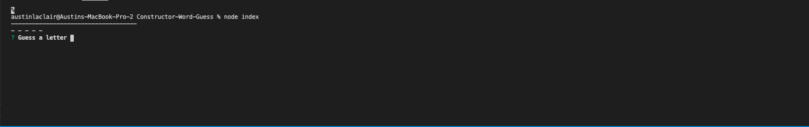
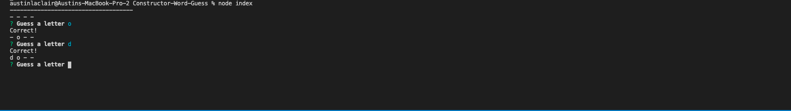
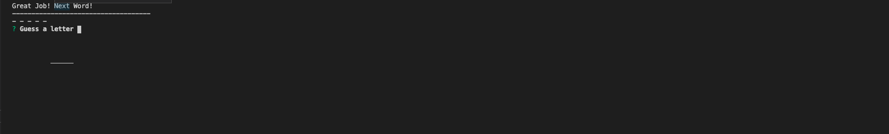

# Constructor-Word-Guess
## What is Constructor-Word-Guess?
Constructor Word Guess is a node command line application where you play a game that sort of represents hangman. Just guess your letter and then...
well you know how to play hangman
## How to Play
Once you have the repo on your local machine, run npm i and then node index and you should be to go :)
## Screenshots
  
